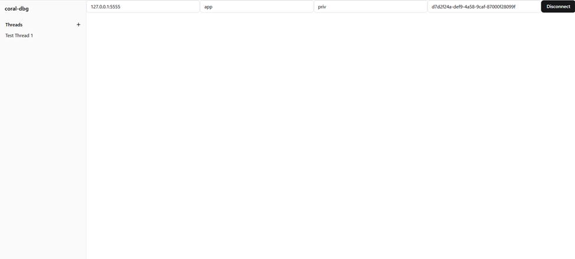
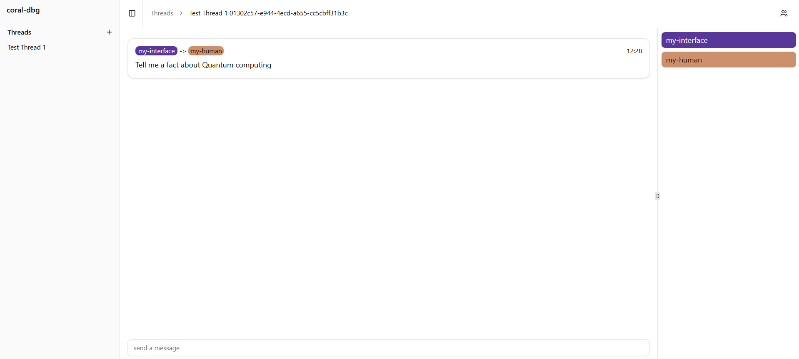

# Coral Protocol Multi-Agent Implementation Guide

This guide walks you through setting up and using a multi-agent system with Coral Protocol, featuring 2 specialized agents: Coral-Interface Agent, Human-In-Loop-Agent, and an interface agent.

## Prerequisites

- Node.js and npm installed
- Python environment
- Postman or similar API testing tool
- Required API keys:
  - OpenAI API Key
  - LINKUP API Key

## Setup Steps
### 1. Choose your agent

You can choose the agents you want to use for your multi-agent system from this repo: https://github.com/Coral-Protocol/awesome-agents-for-multi-agent-systems

#### Clone Coral-Interface-Agent
```bash
git clone https://github.com/Coral-Protocol/Coral-Interface-Agent.git
cd Coral-Interface-Agent
```

#### Clone Human-In-Loop-Agent
```bash
git clone https://github.com/Coral-Protocol/Human-In-Loop-Agent.git
cd Human-In-Loop-Agent
```

#### Clone Coral-OpenDeepResearch-Agent
```bash
git clone https://github.com/Coral-Protocol/Coral-OpenDeepResearch-Agent.git
cd Coral-OpenDeepResearch-Agent
```

### 2. Backend Setup

#### Clone and Configure coral-server
```bash
git clone https://github.com/Coral-Protocol/coral-server.git
cd coral-server
```

#### Configure Agents
Edit `src/main/resources/application.yaml` to include the following agent configurations:

```yaml
registry:
  coral-interface:
    options:
      - name: "OPENAI_API_KEY"
        type: "string"
        description: "OpenAI API Key for LangChain Interface Agent"
    runtime:
      type: "executable"
      command: [ "bash", "-c", "cd ../Coral-Interface-Agent && uv sync && uv run python 0-langchain-interface.py" ]
      environment:
        - name: "OPENAI_API_KEY"
          from: "OPENAI_API_KEY"
  coral-human:
    options:
      - name: "OPENAI_API_KEY"
        type: "string"
        description: "OpenAI API Key for LangChain Interface Agent"
    runtime:
      type: "executable"
      command: [ "bash", "-c", "cd ../Human-In-Loop-Agent && uv sync && uv run python main.py" ]
      environment:
        - name: "OPENAI_API_KEY"
          from: "OPENAI_API_KEY"
  coral-research:
    options:
      - name: "OPENAI_API_KEY"
        type: "string"
        description: "OpenAI API Key for LangChain Interface Agent"
      - name: "LINKUP_API_KEY"
        type: "string"
        description: "LINKUP API KEY for LangChain Interface Agent"
    runtime:
      type: "executable"
      command: [ "bash", "-c", "cd ../Coral-OpenDeepResearch-Agent && uv sync && uv run python langchain_open_deep_research.py" ]
      environment:
        - name: "OPENAI_API_KEY"
          from: "OPENAI_API_KEY"
        - name: "LINKUP_API_KEY"
          from: "LINKUP_API_KEY"
```

#### Start coral-server
```bash
./gradlew run
```

### 3. Create Session

Using Postman or your preferred API client:

**Request:**
```http
POST http://localhost:5555/sessions
```

**Body:**
```json
{
  "sessionId": "test-session",
  "applicationId": "app",
  "privacyKey": "priv",
  "agentGraph": {
    "agents": {
      "my-human": {
        "type": "local",
        "agentType": "coral-human",
        "options": {
          "OPENAI_API_KEY": "OPENAI_API_KEY"
        }
      },
      "my-deepresearch": {
        "type": "local",
        "agentType": "coral-research",
        "options": {
          "OPENAI_API_KEY": "OPENAI_API_KEY",
          "OPENAI_API_KEY": "LINKUP_API_KEY",
        }
      },
      "my-interface": {
        "type": "local",
        "agentType": "coral-interface",
        "options": {
          "OPENAI_API_KEY": "OPENAI_API_KEY"
        }
      }
    },
    "links": [
      ["my-human", "my-interface", "my-deepresearch"]
    ]
  }
}
```

**Response:**
```json
{
    "sessionId": "YOUR_SESSION_ID",
    "applicationId": "app",
    "privacyKey": "priv"
}
```

### 4. Connect Agents to Session

Connect each agent to the session using SSE (Server-Sent Events):

1. **Coral Interface Agent:**
```http
GET http://127.0.0.1:5555/devmode/app/priv/YOUR_SESSION_ID/sse?agentId=my-interface
```

2. **Human-In-Loop Agent:**
```http
GET http://127.0.0.1:5555/devmode/app/priv/YOUR_SESSION_ID/sse?agentId=my-human
```
3. **OpenDeepResearch Agent:**
```http
GET http://127.0.0.1:5555/devmode/app/priv/YOUR_SESSION_ID/sse?agentId=my-deepresearch
```

### 5. Create Thread

**Request:**
```http
POST http://127.0.0.1:5555/debug/app/priv/YOUR_SESSION_ID/my-interface/thread/
```

**Body:**
```json
{
    "threadName": "Test Thread 1",
    "participantIds": ["my-interface", "my-human", "my-deepresearch"]
}
```

**Response:**
```json
{
    "id": "YOUR_THREAD_ID",
    "name": "Test Thread 1",
    "creatorId": "my-interface",
    "participants": [
        "my-interface",
        "my-human",
        "my-deepresearch"
    ],
    "messages": [],
    "isClosed": false,
    "summary": null
}
```

### 6. Frontend Setup (coral-dbg)

#### Clone and Setup
```bash
git clone https://github.com/Coral-Protocol/coral-dbg.git
cd coral-dbg
npm install -g yarn
yarn install
yarn dev
```

The interface will be available at `http://localhost:5173`

#### Connect to Session
1. Enter the coral-server URL (default: `http://127.0.0.1:5555`)
2. Enter the applicationId (`app`)
3. Enter the privacyKey (`priv`)
4. Enter the sessionID (`YOUR_SESSION_ID`)
5. Click "Connect"



### 7. Send Messages

**Request:**
```http
POST http://127.0.0.1:5555/debug/app/priv/YOUR_SESSION_ID/my-interface/thread/sendMessage/
```

**Body:**
```json
{
    "threadId": "YOUR_THREAD_ID",
    "content": "Please have the Human-in-Loop agent share a fact about artificial intelligence, and then have the OpenDeepResearch agent research and validate this fact.",
    "mentions": ["my-human", "my-deepresearch"]
}
```

**Response:**
```json
{
    "id": "aef966a2-39ff-4bdf-846a-e604659e7d4b",
    "threadName": "Test Thread 1",
    "threadId": "YOUR_THREAD_ID",
    "senderId": "my-interface",
    "content": "Please have the Human-in-Loop agent share a fact about artificial intelligence, and then have the OpenDeepResearch agent research and validate this fact.",
    "timestamp": 1749810749374,
    "mentions": [
        "my-human",
        "my-deepresearch"
    ]
}
```

## Viewing Messages

1. In coral-dbg interface, click on "Test Thread 1"
2. You'll see:
   - List of agents in the thread
   - Thread messages
   - Real-time updates when new messages are sent

