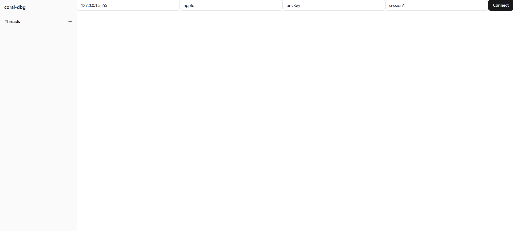
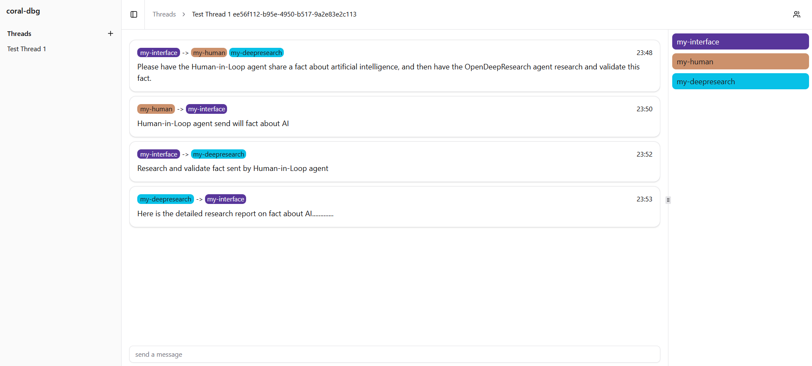

# Building a Multi-Agent System with Coral Protocol

This guide helps you build and run a multi-agent system using Coral Protocol. Whether you're experienced with agents or just getting started, follow this step-by-step to set up, run, and visualize agent interactions.


## Table of Contents

- [Overview](#overview)
- [Prerequisites](#prerequisites)
- [Setup Guide](#setup-guide)
  - [1. Repository Setup](#1-repository-setup)
  - [2. Backend Server Configuration](#2-backend-server-configuration)
  - [3. Session Management](#3-session-management)
  - [4. Agent Connection](#4-agent-connection)
  - [5. Thread Creation](#5-thread-creation)
  - [6. Message Handling](#6-message-handling)
  - [7. Coral Debugger Setup](#7-coral-debugger-setup)
- [Troubleshooting](#troubleshooting)
- [Next Step](#nextstep)

## Overview

[Coral Protocol](https://www.coralprotocol.org/) provides collaboration infrastructure for AI agents. It enables communication, coordination, trust, and payments for the Internet of Agents, laying the foundation for safe AGI.

Coral supports multiple agent frameworks. You can pick from the [Awesome Agent List](https://github.com/Coral-Protocol/awesome-agents-for-multi-agent-systems)

For this guide, we'll use:

**1. Coral Interface Agent** – The Coral Interface Agent is the main interface for receiving user instructions, coordinating multi-agent tasks, and logging conversations via the terminal.

**2. Human-In-Loop Agent** – A communication agent that waits for messages from other agents and responds with requested fun content(joke/quote/fact).

**3. OpenDeepResearch Agent** – The Open Deep Research agent is an open-source AI assistant that automates in-depth research and report generation via multi-agent workflows, supporting web search, structured reporting, human feedback, and API/LLM integration.

We'll run them with a Coral backend (`coral-server`) and visualize everything with the Coral Debugging UI (`coral-dbg`).

## Prerequisites

### Required Software

| Tool       | Version | Installation Link                              |
| ---------- | ------- | ---------------------------------------------- |
| Node.js    | ≥ 18    | [Download](https://nodejs.org/)                |
| Python     | ≥ 3.10  | [Download](https://www.python.org/downloads/)  |
| Java (JDK) | 24      | [Download](https://jdk.java.net/24/)           |
| Postman    | Any     | [Download](https://www.postman.com/downloads/) |

### Required API Keys

- [OpenAI API Key](https://platform.openai.com/account/api-keys)
- [LINKUP API Key](https://app.linkup.so/home)

## Setup Guide

### 1. Repository Setup

<details>
<summary>Clone Required Repositories</summary>

```bash
# Create project directory
mkdir coral-project
cd coral-project

# Clone agent repositories
git clone https://github.com/Coral-Protocol/Coral-Interface-Agent.git
git clone https://github.com/Coral-Protocol/Human-In-Loop-Agent.git
git clone https://github.com/Coral-Protocol/Coral-OpenDeepResearch-Agent.git

# Clone backend and debugger
git clone https://github.com/Coral-Protocol/coral-server.git
git clone https://github.com/Coral-Protocol/coral-dbg.git
```

</details>

### 2. Backend Server Configuration

<details>
<summary>Configure and Start Server</summary>

1. Navigate to server directory:

```bash
cd coral-server
```

2. Update `src/main/resources/application.yaml` with the following configuration:

   Replace the `registry` section in:

```yaml
src/main/resources/application.yaml
```

    With the following

    > **Important**: Don't hardcode your API keys in this file. You'll provide them dynamically via API later.

```yaml
registry:
  coral-interface:
    options:
      - name: "OPENAI_API_KEY"
        type: "string"
        description: "OpenAI API Key for LangChain Interface Agent"
    runtime:
      type: "executable"
      command:
        [
          "bash",
          "-c",
          "cd ../Coral-Interface-Agent && uv sync && uv run python 0-langchain-interface.py",
        ]
      environment:
        - name: "OPENAI_API_KEY"
          from: "OPENAI_API_KEY"

  coral-human:
    options:
      - name: "OPENAI_API_KEY"
        type: "string"
        description: "OpenAI API Key for Human Agent"
    runtime:
      type: "executable"
      command:
        [
          "bash",
          "-c",
          "cd ../Human-In-Loop-Agent && uv sync && uv run python main.py",
        ]
      environment:
        - name: "OPENAI_API_KEY"
          from: "OPENAI_API_KEY"

  coral-research:
    options:
      - name: "OPENAI_API_KEY"
        type: "string"
        description: "OpenAI API Key for Research Agent"
      - name: "LINKUP_API_KEY"
        type: "string"
        description: "LINKUP API KEY for Research Agent"
    runtime:
      type: "executable"
      command:
        [
          "bash",
          "-c",
          "cd ../Coral-OpenDeepResearch-Agent && uv sync && uv run python langchain_open_deep_research.py",
        ]
      environment:
        - name: "OPENAI_API_KEY"
          from: "OPENAI_API_KEY"
        - name: "LINKUP_API_KEY"
          from: "LINKUP_API_KEY"
```

#### Understanding application.yaml Structure (Optional)

The `application.yaml` file is the core configuration file for the Coral server. Here's a detailed breakdown:

<details>
<summary>Basic Structure</summary>

```yaml
registry:
  agent-name:                       # Unique identifier for your agent
    options:                        # Configuration options for the agent
      - name: "API_KEY_NAME"        # Name of the environment variable
        type: "string"              # Type of the option
        description: "..."          # Description of the option
    runtime:                        # Runtime configuration
      type: "executable"            # Type of runtime (executable, docker, etc.)
      command: [...]                # Command to start the agent
      environment:                  # Environment variables
        - name: "ENV_VAR"           # Environment variable name
          from: "OPTION_NAME"       # Maps to an option defined above
```
</details>

<details>
<summary>Adding a New Agent</summary>

Add a new entry under the `registry` section:

```yaml
registry:
  your-new-agent: # Replace with your agent's name
    options:
      - name: "REQUIRED_API_KEY"
        type: "string"
        description: "Description of the API key"
    runtime:
      type: "executable"
      command:
        [
          "bash",
          "-c",
          "cd ../Your-Agent-Directory && uv sync && uv run python your_agent.py",
        ]
      environment:
        - name: "REQUIRED_API_KEY"
          from: "REQUIRED_API_KEY"
```
</details>

<details>
<summary>Tips for Agent Configuration</summary>

> - Each agent must have a unique name in the registry
> - Environment variables must be properly mapped from options
> - Command paths should be relative to the coral-server directory
> - Make sure all required dependencies are installed in the agent's directory
</details>

3. Start the server:

```bash
./gradlew run
```

> **Important**: Keep the server terminal open and use a new terminal for subsequent steps.

</details>

### 3. Session Management

<details>
<summary>Create a New Session</summary>

Use Postman to create a new session:

**Request Details:**

- Method: `POST`
- URL: `http://localhost:5555/sessions`
- Body:

```json
{
  "sessionId": "test-session",
  "applicationId": "app",
  "privacyKey": "priv",
  "agentGraph": {
    "agents": {
      "my-human": {
        "type": "local",
        "agentType": "coral-human",
        "options": {
          "OPENAI_API_KEY": "YOUR_OPENAI_API_KEY"
        }
      },
      "my-deepresearch": {
        "type": "local",
        "agentType": "coral-research",
        "options": {
          "OPENAI_API_KEY": "YOUR_OPENAI_API_KEY",
          "LINKUP_API_KEY": "YOUR_LINKUP_API_KEY"
        }
      },
      "my-interface": {
        "type": "local",
        "agentType": "coral-interface",
        "options": {
          "OPENAI_API_KEY": "YOUR_OPENAI_API_KEY"
        }
      }
    },
    "links": [["my-human", "my-interface", "my-deepresearch"]]
  }
}
```

#### Understanding Agent Graph Structure (Optional)

The `agentGraph` is a crucial component that defines how agents interact within a session. Here's a detailed breakdown:

<details>
<summary>Basic Structure</summary>

```json
"agentGraph": {
  "agents": {                      
    "agent-id": {                  
      "type": "local",             
      "agentType": "agent-name",   
      "options": {                 
        "API_KEY": "value"         
      }
    }
  },
  "links": [                       
    ["agent1", "agent2", "agent3"] 
  ]
}
```
</details>

<details>
<summary>Adding a New Agent to the Graph</summary>

a. Add a new entry in the `agents` object:
```json
"agents": {
  "your-new-agent": {
    "type": "local",
    "agentType": "your-new-agent",  
    "options": {
      "REQUIRED_API_KEY": "YOUR_API_KEY",
      "OTHER_OPTION": "value"
    }
  }
}
```

b. Update the `links` array to include the new agent:
```json
"links": [
  ["existing-agent", "your-new-agent"],  
  ["agent1", "your-new-agent", "agent2"] 
]
```
</details>

<details>
<summary>Tips for Agent Graph Configuration</summary>

> - Each agent ID must be unique within the session
> - The `agentType` must match a registered agent in application.yaml
> - Links define the communication flow between agents
> - Agents can be part of multiple communication paths
> - Circular dependencies in links are allowed but should be used carefully
> - All required options (API keys, etc.) must be provided for each agent
</details>

**Expected Response:**

```json
{
  "sessionId": "YOUR_SESSION_ID",
  "applicationId": "app",
  "privacyKey": "priv"
}
```

> **Note**: Save the `sessionId` (`YOUR_SESSION_ID`) for future requests.

</details>

### 4. Agent Connection

<details>
<summary>Connect Agents to Session</summary>

Open three separate Postman tabs and run these GET requests:

```http
GET http://127.0.0.1:5555/devmode/app/priv/YOUR_SESSION_ID/sse?agentId=my-interface
GET http://127.0.0.1:5555/devmode/app/priv/YOUR_SESSION_ID/sse?agentId=my-human
GET http://127.0.0.1:5555/devmode/app/priv/YOUR_SESSION_ID/sse?agentId=my-deepresearch
```

</details>

### 5. Thread Creation

<details>
<summary>Create a New Thread</summary>

**Request Details:**

- Method: `POST`
- URL: `http://127.0.0.1:5555/debug/app/priv/YOUR_SESSION_ID/my-interface/thread/`
- Body:

```json
{
  "threadName": "Test Thread 1",
  "participantIds": ["my-interface", "my-human", "my-deepresearch"]
}
```

**Expected Response:**

```json
{
  "id": "YOUR_THREAD_ID",
  "name": "Test Thread 1",
  "creatorId": "my-interface",
  "participants": ["my-interface", "my-human", "my-deepresearch"],
  "messages": [],
  "isClosed": false,
  "summary": null
}
```

> **Note**: Save the returned `threadId` for future use.

</details>

### 6. Message Handling

<details>
<summary>Send Messages</summary>

**Request Details:**

- Method: `POST`
- URL: `http://127.0.0.1:5555/debug/app/priv/YOUR_SESSION_ID/my-interface/thread/sendMessage/`
- Body:

```json
{
  "threadId": "YOUR_THREAD_ID",
  "content": "Please have the Human-in-Loop agent share a fact about artificial intelligence, and then have the OpenDeepResearch agent research and validate this fact.",
  "mentions": ["my-human", "my-deepresearch"]
}
```

**Expected Response:**

```json
{
  "id": "aef966a2-39ff-4bdf-846a-e604659e7d4b",
  "threadName": "Test Thread 1",
  "threadId": "YOUR_THREAD_ID",
  "senderId": "my-interface",
  "content": "Please have the Human-in-Loop agent share a fact about artificial intelligence, and then have the OpenDeepResearch agent research and validate this fact.",
  "timestamp": 1749810749374,
  "mentions": ["my-human", "my-deepresearch"]
}
```

</details>

### 7. Coral Debugger Setup

<details>
<summary>Launch Debugger UI</summary>

> **Important**: Open a new terminal window (keep coral-server running in another).

1. Navigate to the debugger directory:

```bash
cd ../coral-dbg
```

2. Install dependencies and start the development server:

```bash
npm install -g yarn
yarn install
yarn dev
```

3. Access the debugger UI:

- Open [http://localhost:5173](http://localhost:5173) in your browser



- Connect using these credentials:
  - Server URL: `http://127.0.0.1:5555`
  - App ID: `app`
  - Privacy Key: `priv`
  - Session ID: `YOUR_SESSION_ID`



> **Tip**: The debugger UI provides real-time visualization of agent interactions, threads, and messages.

</details>

## Troubleshooting

Common issues and solutions will be added here based on user feedback and experience.

---

> **Tip**: For the best experience, ensure all API keys are properly configured and the server is running before attempting to create sessions or send messages.

### Next Steps
Congratulations! You've successfully built and run a multi-agent system. Here's what you can do next:

-Experiment with Different Agents
  -Try agents from the awesome-agents repository
  -Mix and match different agent types
  -Create your own custom agents

-Build More Complex Workflows
  -Create multi-step processes
  -Add conditional logic to agent interactions
  -Experiment with different communication patterns

> **Learn More**: [What is Coral Protocol?](https://docs.coralprotocol.org/CoralDoc/Introduction/WhatisCoralProtocol)
